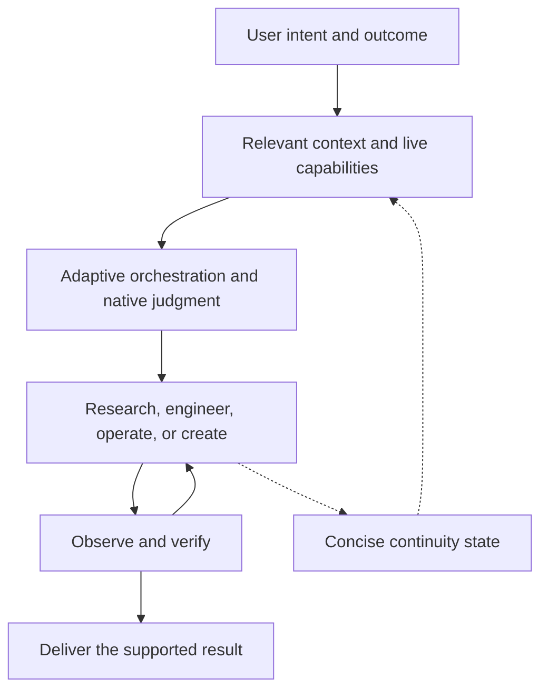

# Agent Engineering OS

Agent Engineering OS is a capability-first skill for turning goals into verified work. It combines research, software engineering, computer/app operation, creative production, and project continuity in environments that expose those capabilities.

It evolved from Smart Model Router. Model selection is now an optional optimization inside the work, rather than the organizing principle. The current model retains responsibility for reasoning, decomposition, architecture, research depth, tools, and verification.

## Why it exists

A durable skill should define useful outcomes, authorization boundaries, evidence standards, and continuity without freezing an advanced model into yesterday's methods. Agent Engineering OS uses live runtime capabilities and permits newer mechanisms to supersede the examples in its documentation.

It does not promise that instructions can eliminate all performance constraints. Its design avoids fixed model hierarchies, reasoning ladders, mandatory agent pipelines, and compulsory routing tables.

## Architecture



The diagram describes relationships, not a required pipeline. A simple stable question can receive a direct answer. A repository fix can involve inspection, implementation, and focused tests. A larger product can combine source research, engineering, app operation, and rendered QA.

## Capabilities

- **Research:** retrieve and inspect relevant sources, evaluate quality and disagreements, synthesize with citations, and expose material uncertainty.
- **Engineering:** understand actual repositories, implement requested changes, run appropriate checks, debug failures, and verify affected behavior.
- **Security and reliability:** integrate trust boundaries, privacy, authorization, secrets, abuse resistance, infrastructure, observability, and recovery into relevant engineering work. Scale checks to exposure and consequence.
- **Computer and app work:** operate available files, terminals, browsers, connected apps, or cloud environments and inspect resulting state.
- **Creative production:** preserve coherent visual direction, use appropriate media, track asset provenance, optimize performance, and inspect desktop/mobile output and motion.
- **Motion and video:** compose code, captured footage, generated media, or a hybrid; preserve brand/character continuity, editable timing, reproducible renders, and exported-output verification when relevant.
- **Browser audiovisual work:** build code-driven visuals and synthesized sound when appropriate, with shared timing, deliberate playback controls, technical audio checks, and distinct interactive/exported deliverables.
- **Artifact reconstruction:** inspect authorized shipped artifacts or observed behavior, distinguish static evidence from runtime findings, and verify a scoped reimplementation without promising recovery of original source.
- **Collaboration:** use real subagents or parallel work when independence, specialist context, or verification makes it worthwhile.
- **Continuity:** resume from compact evidence-backed checkpoints reconciled with live files and operations.

These are composable capabilities, not mandatory stages. The reference files are loaded only when useful.

The skill can evolve through actual use: inspect new capabilities, experiment, observe failures, revise the approach, and preserve evidence-backed lessons where persistence is supported. When skill maintenance is authorized and available, update and validate the reusable instructions themselves. Replace obsolete tools, sources, and methods rather than treating them as permanent boundaries. Saved instructions and project knowledge do not train model weights or create continuous background execution.

## Install

The installable bundle is [agent-engineering-os/](agent-engineering-os/). Keep its `SKILL.md`, `agents/`, `references/`, and `assets/` together.

For a Codex environment with a supported skill installer, ask it to install the inner folder from this repository:

```text
Install the skill from https://github.com/AdnanNaous/agent-engineering-os/tree/main/agent-engineering-os
```

For manual installation into a Codex user-skills directory:

| Environment | Destination |
| --- | --- |
| Windows | `%USERPROFILE%\.codex\skills\agent-engineering-os\` |
| macOS / Linux | `~/.codex/skills/agent-engineering-os/` |

Follow your runtime's current skill discovery instructions. In ChatGPT environments that support personal skills, use the supported creation/import interface; publishing on GitHub alone does not install a skill. If skill loading is unavailable, provide `SKILL.md` and the relevant supporting references as instructions, with capabilities limited to that environment.

### Migration

Replace an existing local `smart-model-router` installation with the new bundle, preserving any personal modifications first. Avoid keeping both active unless you intentionally want overlapping triggers. This release changes the skill slug, UI metadata, examples, and folder links; Git history remains in the same repository.

The repository and installable skill now use the slug `agent-engineering-os`. For existing clones, update the remote without replacing the checkout or its history:

```sh
git remote set-url origin https://github.com/AdnanNaous/agent-engineering-os.git
```

## Examples

```text
$agent-engineering-os Fix the failing checkout flow in this repository.
Inspect the cause, implement the fix, and verify the affected behavior.
```

```text
$agent-engineering-os Compare current options for this architecture using
primary sources, then implement the appropriate choice in the existing app.
```

```text
$agent-engineering-os Repair the mobile layout and motion in my portfolio.
Preserve its identity and inspect the rendered result.
```

```text
$agent-engineering-os Continue from this project's checkpoint.
Reconcile it with the current files and finish the remaining authorized work.
```

```text
$agent-engineering-os Build this public API and payment integration.
Verify server-side access, payment state, replay/concurrency behavior,
production configuration, and recovery according to the actual stack.
```

Security guidance is activated for relevant public/sensitive systems, not trivial code questions. It is integrated into design and implementation, rather than relying on a scanner after the application is built. Findings and checks need evidence; the skill does not certify a system as secure or compliant.

```text
$agent-engineering-os Make a launch film for this product using its actual
features and brand. Choose an available production approach, inspect the
export, and leave editable sources and reproducible render instructions.
```

```text
$agent-engineering-os Reconstruct the behavior of this authorized shipped
artifact. Separate observation from inference, implement the requested
compatible behavior, and verify the important boundaries.
```

Creative references are selected for the brief, not treated as a permanent toolchain or model benchmark. Repeated production can maintain a runnable project with brand tokens, licensed assets, scene components, timeline data, render commands, and concise checkpoints. This does not require a large prompt or a fixed agent team.

You can initiate work from a phone/chat conversation. Actual execution uses available environments and tools; the skill does not create an automatic transfer to another computer, chat, or coding runtime.

## Bundle

| File | Purpose |
| --- | --- |
| [SKILL.md](agent-engineering-os/SKILL.md) | Compact operating principles and reference activation |
| [agents/openai.yaml](agent-engineering-os/agents/openai.yaml) | UI metadata and invocation example |
| [capability-orchestration.md](agent-engineering-os/references/capability-orchestration.md) | Live discovery, optional routing, portability |
| [research.md](agent-engineering-os/references/research.md) | Evidence quality, contradictions, citations |
| [software-engineering.md](agent-engineering-os/references/software-engineering.md) | Implementation, debugging, AI-agent systems, delivery |
| [security-reliability-infrastructure.md](agent-engineering-os/references/security-reliability-infrastructure.md) | Threat-aware engineering, privacy, infrastructure, reliability, and adversarial verification |
| [computer-work.md](agent-engineering-os/references/computer-work.md) | Environment/app execution and final-state verification |
| [project-team.md](agent-engineering-os/references/project-team.md) | Useful delegation and integration |
| [continuity.md](agent-engineering-os/references/continuity.md) | Checkpoint and resumption |
| [creative-production.md](agent-engineering-os/references/creative-production.md) | Creative research and production |
| [motion-video-production.md](agent-engineering-os/references/motion-video-production.md) | Code/generated/hybrid films, timing, identity, repeatable export, reusable project context |
| [browser-motion-and-audio.md](agent-engineering-os/references/browser-motion-and-audio.md) | Browser timing, procedural sound, autoplay/replay, graceful degradation, audio and export verification |
| [reverse-engineering.md](agent-engineering-os/references/reverse-engineering.md) | Authorized artifact analysis, behavioral reconstruction, evidence and parity limits |
| [visual-web.md](agent-engineering-os/references/visual-web.md) | Visual website implementation and inspection |
| [visual-assets-and-performance.md](agent-engineering-os/references/visual-assets-and-performance.md) | Asset provenance, optimization, rendering budgets |
| [visual-motion-and-review.md](agent-engineering-os/references/visual-motion-and-review.md) | Motion construction and observed review |
| [STATE_TEMPLATE.md](agent-engineering-os/assets/STATE_TEMPLATE.md) | Compact handoff template |

## Validation

Run `python3 tools/validate_skill.py` from the repository root to check metadata, bundle paths, invocation coherence, and relative documentation links. Run `python3 -m unittest discover -s tests` for the validator's failure cases. The validation tooling requires Python 3.9+ and PyYAML (`python3 -m pip install PyYAML`) if your environment does not already provide it.

Structural checks cannot prove future model behavior, security, or successful task completion. Behavioral evaluation still requires realistic tasks and observed results. Changes should be reviewed for unnecessary prescriptions as well as correctness.

See [observed behavioral evaluation](tests/behavioral-evaluation.md) for the local tasks exercised during this migration and their verification limits.

See [creative evidence and evaluation](tests/creative-evaluation.md) for the inspected social demonstrations, primary production sources, resulting additions, and local execution checks. These observations inform conditional guidance; they do not establish model rankings or guarantee equivalent film quality.

## Limits

A skill supplies instructions, not new capabilities or permissions. It cannot unlock apps, select unexposed models, change the main chat model without controls, access an unrelated device, guarantee persistence, bypass quotas, or provide paid API usage through a subscription.

Tools, access, model controls, and skill-loading support vary by runtime. Missing capabilities should produce a precise limitation and useful partial progress. Claims of execution, verification, cost, or savings require actual evidence. No skill guarantees that all code is correct or that every future model will behave identically.
